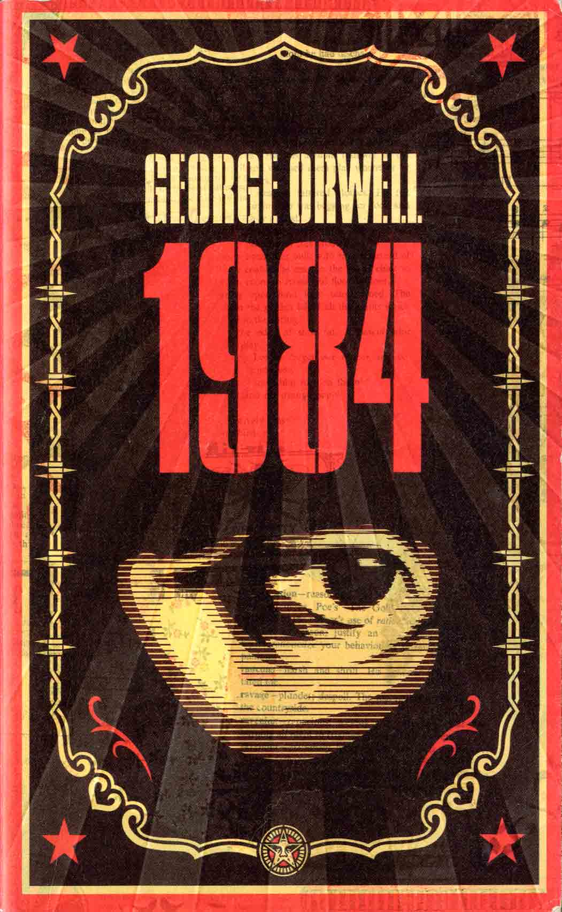

# 1984
_Geornge Orwell_

### 📖 Aylık Okuma | Haziran 2025

🔹 Konu: **Ütopya ve Gerçekler**

🔹 Okuma Başlığı: **1984**

🔹 Yazar: **George Orwell**

🔹 Tür: **Distopya - Kitap**

🔹 Sayfa Sayısı / Süre: **352 sayfa**

🔹 Link / Erişim: [WhatsApp Grubu](https://chat.whatsapp.com/FujPEIaJi0fDMYLS7WfOZn)

### 📌 Okumanın Amacı:

Bu ay George Orwell'in distopik romanı olan **1984** adlı eserini okuyacağız. Kitap, totaliter bir rejim altında bireylerin nasıl kontrol edildiğini ve özgürlüklerin nasıl kısıtlandığını anlatıyor. Türkçe'ye _Can Yayınları_ tarafından çevrilen bu eser, modern toplumların eleştirisini yaparken aynı zamanda bireysel özgürlüklerin önemini vurguluyor.

### 🧭 Tartışma Soruları:

- Kitapta anlatılan totaliter rejim, günümüz dünyasında ne kadar gerçekçi?
- Bu romanın bize sunduğu mesajlar nelerdir?

📅 Toplantı Tarihi ve Saati: **2 Temmuz 2025, Çarşamba**, saat **19:30** 
