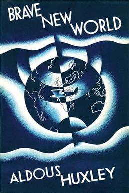

# Cesur Yeni Dünya
_Aldous Huxley_

### 📖 Aylık Okuma | Temmuz 2025

🔹 Konu: **Ütopya ve Gerçekler**

🔹 Okuma Başlığı: **Cesur Yeni Dünya**

🔹 Yazar: **Aldous Huxley**

🔹 Tür: **Bilim Kurgu - Kitap**

🔹 Sayfa Sayısı / Süre: **272 sayfa**

🔹 Link / Erişim: [WhatsApp Grubu](https://chat.whatsapp.com/FujPEIaJi0fDMYLS7WfOZn)

### 📌 Okumanın Amacı:

Bu ay Aldous Huxley'in ünlü bilim kurgu romanı **Cesur Yeni Dünya**'yı okuyacağız. Kitap, teknolojinin ve bilimsel ilerlemenin insan yaşamını nasıl şekillendirdiğini, bireyselliğin nasıl yok olduğunu ve toplumun nasıl kontrol edildiğini ele alıyor. 

### 🧭 Tartışma Soruları:
- Teknolojinin insan yaşamına etkileri nelerdir?
- Bireysellik ve özgürlük kavramları bu romanda nasıl ele alınıyor?
- Kitapta anlatılan distopik toplum, günümüz dünyasında ne kadar gerçekçi?
- Bu romanın bize sunduğu mesajlar nelerdir?

📅 Toplantı Tarihi ve Saati: **1 Ağustos 2025, Cuma**, saat **19:30** 